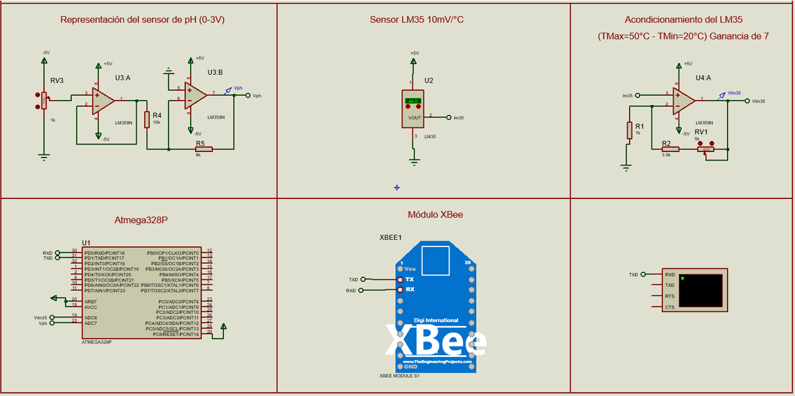
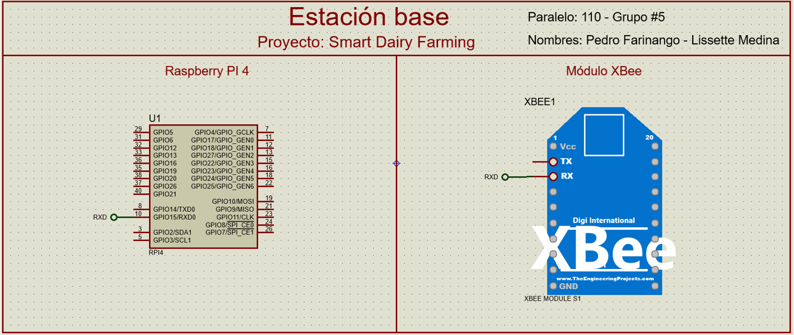
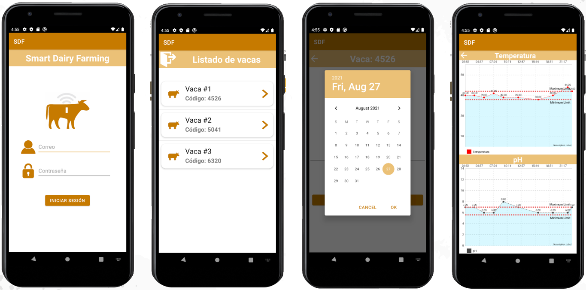

# Grupo_5_ProyectoSDF
*Sistema de monitoreo de temperatura y pH para el control de la salud de la vaca.*

## Integrantes:
* Farinango Salazar Pedro
* Medina Chalén Lissette Elvira

## Descripción
Este repositorio tiene los archivos necesarios para la simulación de un sensor bolus que mide la temperatura y pH dentro del estómago de una vaca (rúmen), donde dichos datos serán enviados a través del protocolo de comunicación zigbee hacia una estación base que tendrá el objetivo de enviar credenciales y los valores de los sensores a una base de datos remota por medio de internet para que posteriormente se pueda monitorear en una aplicación movil estos valores a través de gráficas de temperatura y pH en función del tiempo.

## Archivos Proteus
En la carpeta "Simulaciones" se tendrán dos archivos Proteus que van a representar el sensor bolus y la estación base, cabe recalcar que la versión del software es de 8.11 y para la comunicación de los XBee (COMPIM) se utilizó el programa 'Virtual Serial Port', finalmente, se tiene un documento pdf que explica las simulaciones de todo el proyecto realizado.

## Archivos para la configuración de la base de datos
Para la base de datos remota se utilizó 000Webhost que es gratuito y posee PhpMyAdmin, en la carpeta 'Configuraciones_Base de Datos' se tiene cada uno de los documentos .php que deben ir en File Manager de 000Webhost que permitirán hacer las peticiones post y get a la base de datos, a su vez tiene un archivo pdf que explica la creación de las tablas en las bases de datos con sus respectivos disparadores y relaciones entre cada una de ellas.

## Aplicación móvil
La aplicación movil se la realizó en Android Studio y para acceder a ella se debe de descargar todos los archivos en la carpeta 'Proyecto-SDF' que posee la aplicación que permitirá el monitoreo en la salud de una vaca a través de gráficas de temperatura y pH en función del tiempo.

## Explicación del proyecto
Finalmente, se tiene un link a Youtube en la cual se encuentra la explicación del proyecto de forma breve con las respectivas simulaciones en tiempo real.

## Proyecto Simulado
-Archivo Proteus del sensor bolus

-Archivo Proteus de la estación base

-Aplición móvil en Android Studio

